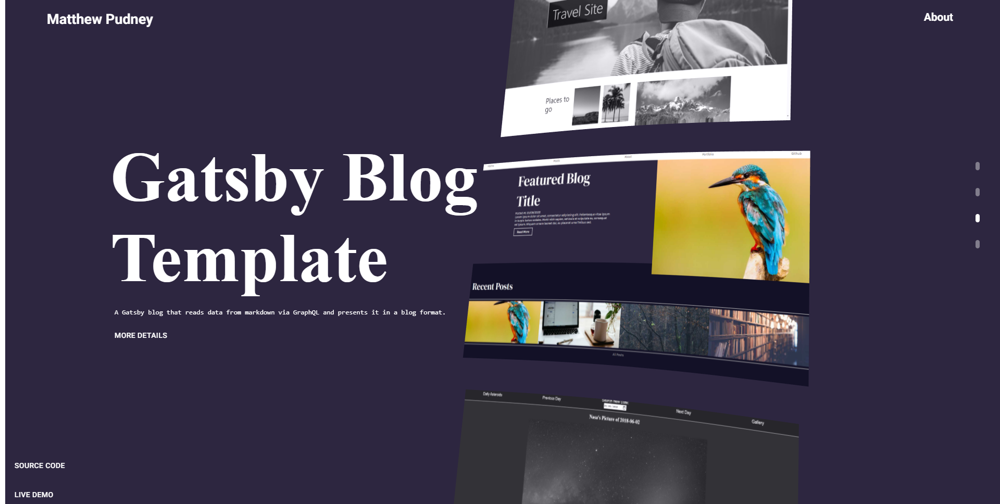
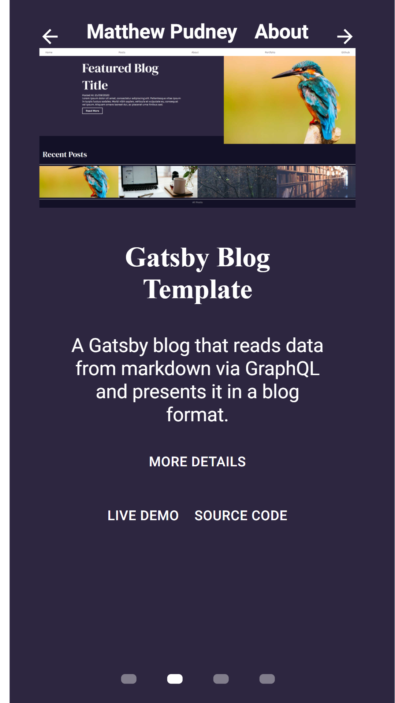
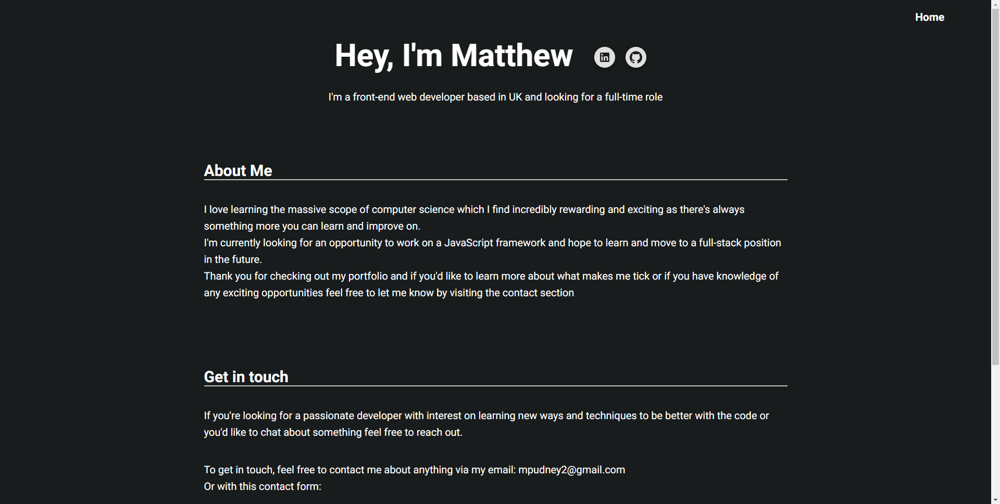
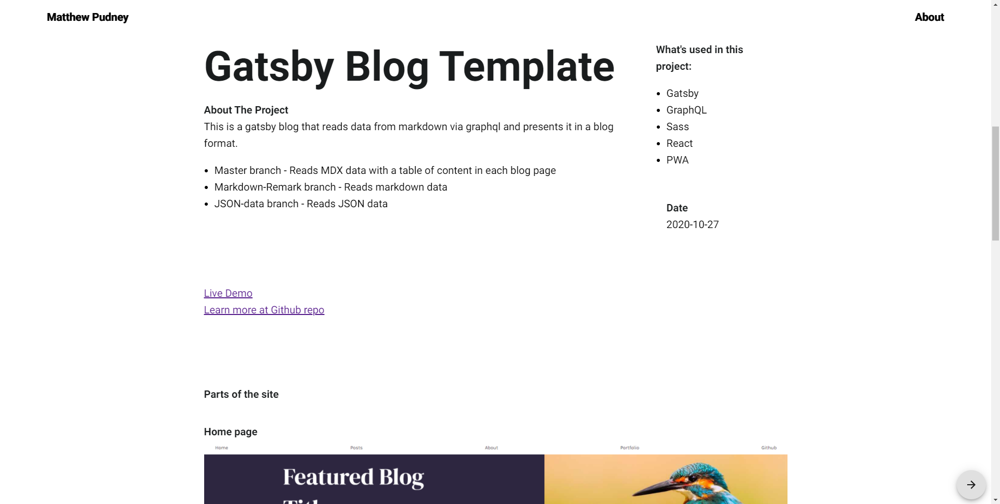

# Three.js Portfolio

_Portfolio thats displays a image carousel using three.js_ 

**[Live Demo]()**

## Summary
This project is designed to display portfolio projects data into three.js from GraphQL queries from contentful.

I wanted to do this as I was inspired by https://robin-noguier.com/ portfolio I saw on https://www.awwwards.com/ to use three.js and improve my ability on animations and transitions. I also wanted to try to do something similar as my previous portfolio was very simple and I wanted to challenge myself. This is at the moment a two week project of learning three.js, react-three-fiber, some Next.JS and some GSAP. I'm still adding to this project and working on improving the page transitions, design and performance.
## Table of Content
1. [Technologies used](Technologies-used)
2. [Parts of the Website](#Parts-of-the-website)
    1. [Home Page](#HomePage)
    2. [Home Page for Small Displays](#HomePage-for-Small-displays)  
    3. [About Page](#About-Page)
    4. [Project pages](#Project-pages)
4. [Things to do](#Things-to-do)

## Technologies used 
1. React
2. Next.JS
4. React-transition-group
5. GSAP
6. Three.JS
7. React-Three-Fiber
8. contentful (Headless CMS)
9. Material-UI

## Parts of the Website

## HomePage

Displays a carousel of images using three.js. 

Can be quickly scrolled through using the scrollwheel, hovering the item markers to the right hand side of the page or by click the images.

## HomePage for Small displays

Used React-use-gesture to work out if a user is swiping to the left or right and made each project of the homepage into a infinite scroller to make the project carousel easier to go through. 

## About Page

Simple about page with description, links and contact forms that works off of netlify forms.

## Project pages

Displays all mdx data and information from contentful for a Particular project. 

## Things that still need to be done

* Merge project page canvas and homepage canvas together by placing a canvas in _app.js to improve the look of page transitions to and from project pages. 

* Convert all images in mdx into next.js responsive images to increase performance and decrease size of site.

* Use Web workers for placement of the images so that performance is saved.

* Improve GSAP animations for text and page load ins.

* Move data into contexts.

* lazy load images and disable images frames out of the canvas to save of performance

* Move CSS into Sass/Modules

